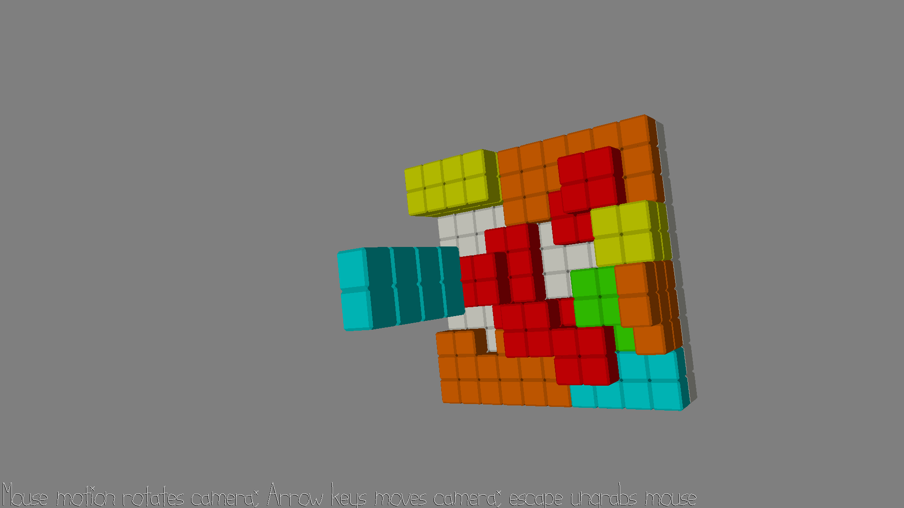

# Octris

Author: Henry Du

Design: (TODO: In two sentences or fewer, describe what is new and interesting about your game.)

Screen Shot:

How To Play:

(TODO: describe the controls and (if needed) goals/strategy.)

This game was built with [NEST](NEST.md).

---
TODO List:
1. Finish Octris scene (likely with different cubes) [DONE]
2. Be able to load scene in game [DONE]
3. Finish definitions for Octris pieces
4. Be able to load pieces in game

5. Add dynamics for pieces (downward motion, translation, rotation, cementing, random spawn)
6. Row clear mechanic
7. Timer & score
